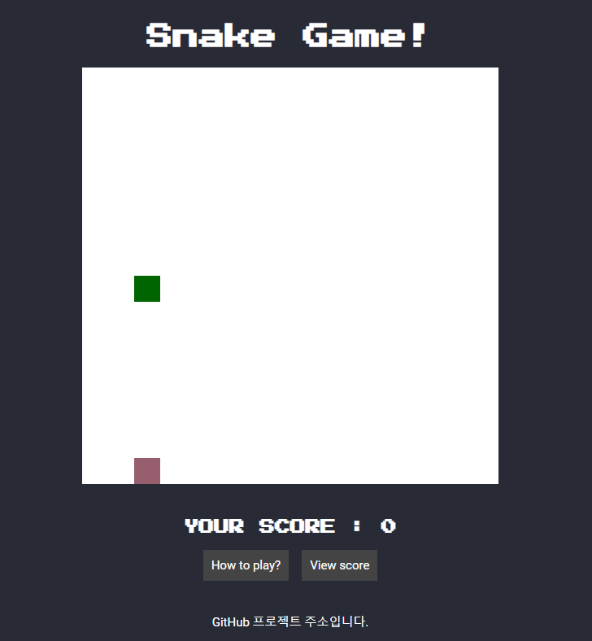

<!-- Badges session -->

  
  <!-- languages -->
  
  <!-- repo size -->
  
  <!-- last commit -->
  
  <!-- licence MIT -->
  

<!--Banner session-->

  

<!--About session-->
<h1 align="center">HTML과 자바 스크립트를 이용하여 타 프로젝트를 업그레이드 했습니다.</h1>

기존 프로젝트에서 색 변경, 도움말 보기, 점수 json-server연동, 종료 화면 등 추가로 구현하였습니다.

<!-- 

  -->

<h3>👨‍💻 Tecnologias utilizadas</h3>

- [HTML](https://www.w3schools.com/html/)
- [CSS](https://developer.mozilla.org/pt-BR/docs/Web/CSS)
- [JavaScript](https://developer.mozilla.org/en-US/docs/Web/JavaScript) 

<!--License session-->
<h3>📝 License</h3>

- [MIT](./LICENSE). 

<!--Bottom session-->
 <h4 align=center>Made with by <a target="_blank" href="https://pleiterson.vercel.app" >Pleiterson Amorim</a></h4>
